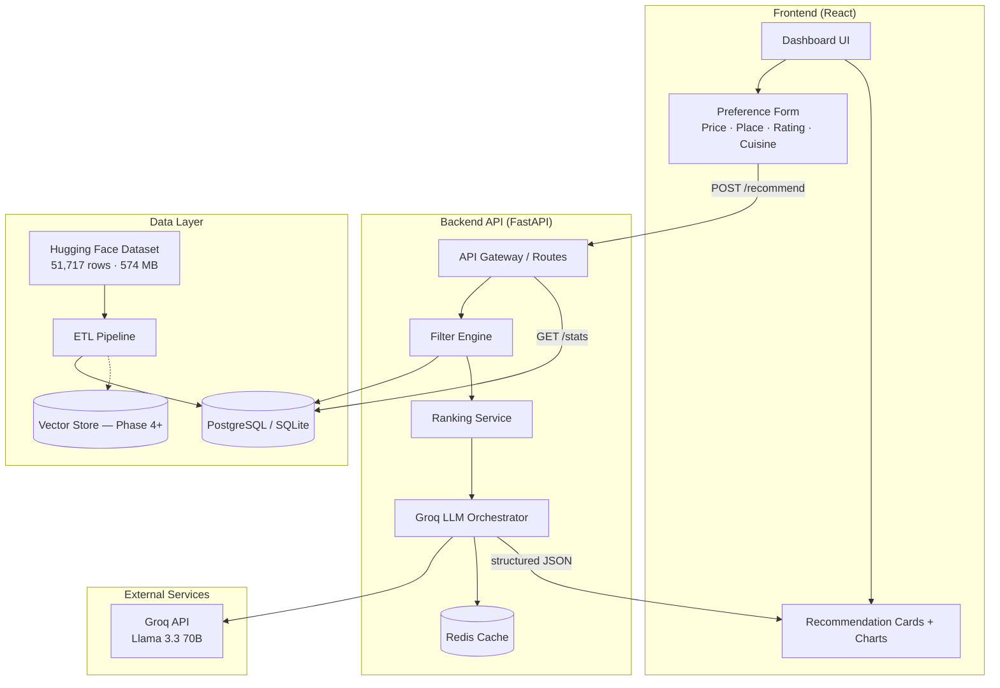
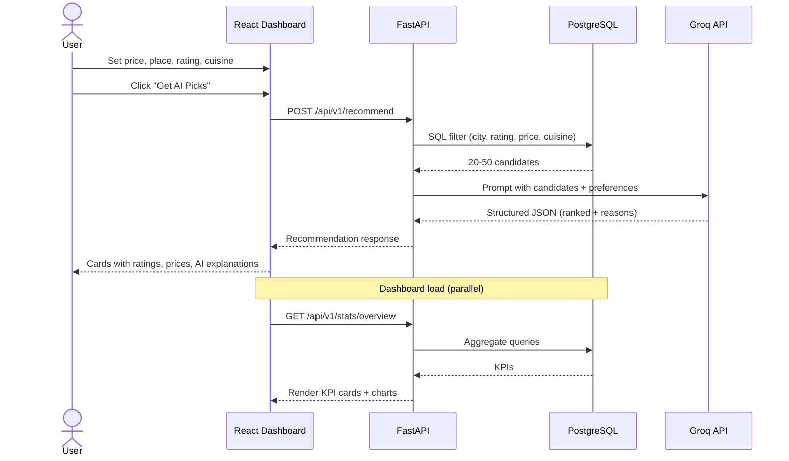

# Zomato AI Restaurant Recommendation Service — Architecture

> **Goal:** Build an AI-powered restaurant recommendation service that accepts user preferences (price, place, rating, cuisine), retrieves relevant restaurants from the [Zomato Hugging Face dataset](https://huggingface.co/datasets/ManikaSaini/zomato-restaurant-recommendation), uses **Groq LLM** to rank and explain results, and presents them in a Zomato-style analytics dashboard.

---

## 1. System Overview

The system follows a **hybrid retrieval + LLM reasoning** pattern:

1. **Hard filters** narrow ~51K restaurants to a small candidate set (place, price, rating, cuisine).
2. **Semantic scoring** (optional in later phases) improves relevance using review text and dish preferences.
3. **Groq LLM layer** ranks the top candidates and generates human-readable explanations — it never sees the full dataset.
4. **Dashboard UI** mirrors the reference design: sidebar navigation, KPI cards, category breakdowns, charts, and a recommendation panel.



---

## 2. Data Source & Schema

**Dataset:** `ManikaSaini/zomato-restaurant-recommendation`  
**Size:** 51,717 restaurants · ~574 MB

### 2.1 Raw Fields (Hugging Face)

| Field | Type | Use in Recommendation |
|-------|------|----------------------|
| `name` | string | Display + LLM context |
| `location` | string (93 values) | **Place filter** (neighborhood) |
| `listed_in(city)` | string (30 cities) | **Place filter** (city) |
| `address` | string | Display |
| `cuisines` | string | **Cuisine filter** (comma-separated) |
| `rate` | string e.g. `4.1/5` | **Rating filter** (parse to float) |
| `votes` | int | Popularity signal |
| `approx_cost(for two people)` | string e.g. `800` | **Price filter** |
| `rest_type` | string | Secondary filter / display |
| `dish_liked` | string | LLM context + semantic search |
| `reviews_list` | string (up to 1.28M chars) | LLM context (truncated) + embeddings |
| `online_order` | Yes/No | Feature flag |
| `book_table` | Yes/No | Feature flag |
| `url` | string | External link |
| `menu_item` | string | Optional display |
| `listed_in(type)` | string | Category charts |

### 2.2 Normalized Database Schema

```sql
-- Core restaurant table (post-ETL)
CREATE TABLE restaurants (
    id              SERIAL PRIMARY KEY,
    name            VARCHAR(255) NOT NULL,
    url             TEXT,
    address         TEXT,
    location        VARCHAR(100),          -- neighborhood
    city            VARCHAR(100),            -- listed_in(city)
    rest_type       VARCHAR(100),
    cuisines        TEXT,                    -- raw string
    cuisine_tags    TEXT[],                  -- parsed: ['North Indian', 'Chinese']
    rating          DECIMAL(3,1),            -- parsed from rate
    votes           INTEGER DEFAULT 0,
    cost_for_two    INTEGER,                 -- parsed integer
    dish_liked      TEXT,
    online_order    BOOLEAN,
    book_table      BOOLEAN,
    listed_in_type  VARCHAR(50),
    review_snippet  TEXT,                    -- first 500 chars of reviews_list
    created_at      TIMESTAMP DEFAULT NOW()
);

CREATE INDEX idx_restaurants_city ON restaurants(city);
CREATE INDEX idx_restaurants_location ON restaurants(location);
CREATE INDEX idx_restaurants_rating ON restaurants(rating);
CREATE INDEX idx_restaurants_cost ON restaurants(cost_for_two);
CREATE INDEX idx_restaurants_cuisines ON restaurants USING GIN(cuisine_tags);
```

### 2.3 ETL Responsibilities

| Step | Action |
|------|--------|
| Load | `datasets.load_dataset("ManikaSaini/zomato-restaurant-recommendation")` |
| Clean | Parse `rate` → float, `approx_cost` → int, handle `null` / encoding issues |
| Transform | Split `cuisines` into `cuisine_tags[]`, extract review snippet |
| Dedupe | Remove duplicate `url` entries |
| Load | Bulk insert into DB |
| Validate | Row count ≈ 51,717; no null ratings on filtered subset |

---

## 3. Recommendation Pipeline

### 3.1 User Preference Model

```json
{
  "place": {
    "city": "Banashankari",
    "location": "Banashankari"       // optional, neighborhood
  },
  "price": {
    "min": 300,
    "max": 800                       // cost for two people (INR)
  },
  "rating": {
    "min": 3.5                       // minimum rating out of 5
  },
  "cuisine": ["North Indian", "Chinese"],
  "preferences": "family dinner, quiet ambience"  // free-text for LLM
}
```

### 3.2 Filter Engine (Deterministic)

```sql
SELECT id, name, location, city, cuisines, rating, votes,
       cost_for_two, dish_liked, review_snippet, url, online_order, book_table
FROM restaurants
WHERE city ILIKE :city
  AND (:location IS NULL OR location ILIKE :location)
  AND rating >= :min_rating
  AND cost_for_two BETWEEN :min_price AND :max_price
  AND cuisine_tags && :cuisine_array    -- overlap match
ORDER BY rating DESC, votes DESC
LIMIT 50;
```

**Output:** 20–50 candidate restaurants (never send all 51K to the LLM).

### 3.3 Groq LLM Orchestrator

**Provider:** [Groq](https://console.groq.com/) — fast inference with open-weight models (Llama 3.x).

**Pattern:** Structured output with grounded context (only filtered candidates).

```
System: You are a Zomato restaurant recommendation assistant.
        Only recommend restaurants from the provided list.
        Never invent restaurants.

User:   Preferences: {json}
        Candidates: {top_20_restaurants_json}

        Return JSON:
        {
          "recommendations": [
            {
              "rank": 1,
              "restaurant_id": 123,
              "name": "...",
              "match_score": 95,
              "reason": "2-3 sentence explanation citing rating, cuisine, price, reviews",
              "highlights": ["4.6★", "₹600 for two", "North Indian"],
              "best_for": "family dinner"
            }
          ],
          "summary": "One paragraph overview of why these fit"
        }
```

**Groq configuration:**

| Setting | Value |
|---------|-------|
| SDK | `groq` Python client |
| Default model | `llama-3.3-70b-versatile` |
| API key | `GROQ_API_KEY` (from [Groq Console](https://console.groq.com/keys)) |
| Why Groq | Sub-second inference, generous free tier, strong JSON structured output |

**Integration snippet (`llm_service.py`):**
```python
from groq import Groq

client = Groq(api_key=settings.GROQ_API_KEY)
response = client.chat.completions.create(
    model=settings.GROQ_MODEL,  # llama-3.3-70b-versatile
    messages=[
        {"role": "system", "content": system_prompt},
        {"role": "user", "content": user_prompt},
    ],
    response_format={"type": "json_object"},
    temperature=0.3,
)
```

### 3.4 Fallback (Groq Unavailable)

If the Groq API is unavailable or rate-limited, return top 10 from the filter engine sorted by `rating × log(votes + 1)` with template-based reasons.

---

## 4. API Design

### 4.1 Core Endpoints

| Method | Endpoint | Description |
|--------|----------|-------------|
| `POST` | `/api/v1/recommend` | Main recommendation (prefs → LLM → results) |
| `GET` | `/api/v1/restaurants` | Paginated browse with filters |
| `GET` | `/api/v1/restaurants/{id}` | Single restaurant detail |
| `GET` | `/api/v1/stats/overview` | Dashboard KPIs |
| `GET` | `/api/v1/stats/cities` | Top cities by restaurant count |
| `GET` | `/api/v1/stats/cuisines` | Cuisine distribution |
| `GET` | `/api/v1/filters/options` | Dropdown values (cities, cuisines, price ranges) |
| `GET` | `/api/health` | Health check |

### 4.2 Example: Recommend Request/Response

**Request:**
```http
POST /api/v1/recommend
Content-Type: application/json

{
  "city": "Banashankari",
  "min_rating": 4.0,
  "max_price": 700,
  "cuisines": ["Cafe", "Italian"],
  "free_text": "rooftop ambience, good pizza"
}
```

**Response:**
```json
{
  "summary": "Based on your preference for Italian cafes in Banashankari with ratings above 4.0...",
  "total_candidates": 23,
  "recommendations": [
    {
      "rank": 1,
      "restaurant_id": 42,
      "name": "Onesta",
      "rating": 4.6,
      "votes": 2556,
      "cost_for_two": 600,
      "location": "Banashankari",
      "cuisines": "Pizza, Cafe, Italian",
      "match_score": 96,
      "reason": "Highest rated Italian cafe in your area with 2,556 votes. Reviewers praise affordable farm-style pizzas and rooftop ambience.",
      "highlights": ["4.6★", "₹600 for two", "Online order"],
      "url": "https://www.zomato.com/..."
    }
  ],
  "latency_ms": 1240
}
```

---

## 5. Frontend Architecture (Reference UI Mapping)

The reference dashboard maps to these UI zones:

```
┌──────────┬─────────────────────────────────────────────────────────────┐
│          │  Dashboard                              [Search city...] 🔍  │
│  Sidebar ├─────────────────────────────────────────────────────────────┤
│          │  ┌─────────────────────────────────────────────────────┐  │
│  🏠 Home │  │ Zomato Banner — KPI strip (cities, restaurants,     │  │
│  👤 User │  │ avg rating, recommendations served)                 │  │
│  📊 Stats│  └─────────────────────────────────────────────────────┘  │
│  📈 Chart│  ┌──────── Overview KPIs ────────────────────────────┐  │
│          │  │ Matching Restaurants │ Avg Rating │ Avg Price │ Top Cuisine│
│  ⚙️ Set  │  └───────────────────────────────────────────────────┘  │
│          │  ┌─ Preference Panel ─┐  ┌─ Top Recommendations ─────────┐ │
│          │  │ City    [▼]       │  │ 🍕 Onesta        4.6★  ₹600   │ │
│          │  │ Cuisine [▼]       │  │ "Best for pizza lovers..."     │ │
│          │  │ Rating  [slider]  │  │ 🍝 Penthouse Cafe 4.0★ ₹700  │ │
│          │  │ Price   [range]   │  │ ...                            │ │
│          │  │ [Get AI Picks]    │  └────────────────────────────────┘ │
│          │  └───────────────────┘  ┌─ Top Cities Chart ────────────┐ │
│          │  ┌─ Cuisine Cards ────┐  │ Banashankari ████████ 120     │ │
│          │  │ North Indian │ Cafe│  │ Basavanagudi ██████ 85        │ │
│          │  └──────────────────┘  └────────────────────────────────┘ │
└──────────┴─────────────────────────────────────────────────────────────┘
```

### 5.1 Page Structure

| Route | Component | Reference UI Element |
|-------|-----------|-------------------|
| `/` | `DashboardPage` | Full dashboard layout |
| `/recommend` | `RecommendPage` | Preference form + result cards |
| `/restaurant/:id` | `RestaurantDetail` | Expanded view with reviews |
| `/analytics` | `AnalyticsPage` | City/cuisine charts |

### 5.2 Tech Stack (Frontend)

| Layer | Choice | Rationale |
|-------|--------|-----------|
| Framework | **React 18 + Vite** | Fast dev, component ecosystem |
| Styling | **Tailwind CSS** | Matches clean card-based reference UI |
| Charts | **Recharts** | Bar/line charts (Top Cities, Rating Trend) |
| State | **TanStack Query** | Server state, caching |
| Icons | **Lucide React** | Sidebar icons |
| Theme | Zomato Red `#E23744` | Brand consistency |

### 5.3 Key Components

```
src/
├── components/
│   ├── layout/
│   │   ├── Sidebar.tsx          # Left icon nav
│   │   ├── Header.tsx           # Title + search
│   │   └── DashboardLayout.tsx
│   ├── dashboard/
│   │   ├── HeroBanner.tsx       # Zomato promo strip
│   │   ├── KpiCards.tsx         # Overview metrics row
│   │   ├── CuisineCards.tsx     # Veg/Non-Veg style category cards
│   │   ├── TopCitiesChart.tsx   # Horizontal bar chart
│   │   └── RatingTrendChart.tsx # Line chart
│   ├── recommend/
│   │   ├── PreferenceForm.tsx   # Price, place, rating, cuisine
│   │   ├── RecommendationCard.tsx
│   │   └── AiSummary.tsx        # LLM summary paragraph
│   └── ui/                      # Button, Card, Slider, Select
├── hooks/
│   ├── useRecommend.ts
│   └── useStats.ts
├── services/
│   └── api.ts
└── pages/
    ├── DashboardPage.tsx
    └── RecommendPage.tsx
```

---

## 6. Backend Architecture

### 6.1 Project Structure

```
backend/
├── app/
│   ├── main.py                  # FastAPI entry
│   ├── config.py                # Settings (DB, LLM keys)
│   ├── api/
│   │   ├── routes/
│   │   │   ├── recommend.py
│   │   │   ├── restaurants.py
│   │   │   └── stats.py
│   │   └── deps.py
│   ├── models/
│   │   ├── restaurant.py        # SQLAlchemy / Pydantic
│   │   └── recommendation.py
│   ├── services/
│   │   ├── filter_service.py    # SQL filtering
│   │   ├── llm_service.py       # Groq prompt + JSON parse
│   │   └── stats_service.py     # Aggregations for dashboard
│   └── db/
│       ├── database.py
│       └── repositories/
├── scripts/
│   ├── ingest_hf_dataset.py     # One-time ETL
│   └── seed_db.py
├── tests/
├── requirements.txt
└── .env.example
```

### 6.2 Tech Stack (Backend)

| Layer | Choice | Rationale |
|-------|--------|-----------|
| API | **FastAPI** | Async, auto OpenAPI docs |
| ORM | **SQLAlchemy 2.0** | Mature, flexible queries |
| DB (dev) | **SQLite** | Zero setup for Phase 1–3 |
| DB (prod) | **PostgreSQL** | GIN indexes for cuisine arrays |
| Cache | **Redis** (Phase 5) | Cache identical preference queries |
| LLM | **Groq** (`groq` SDK) | Fast inference, JSON mode, free tier |
| Validation | **Pydantic v2** | Request/response schemas |

---

## 7. Phased Implementation Plan

### Phase 1 — Data Foundation (Week 1)
**Goal:** Reliable local data layer ready for queries.

| Task | Deliverable |
|------|-------------|
| Project scaffolding | `backend/`, `frontend/`, `docker-compose.yml` |
| HF dataset ingestion script | `scripts/ingest_hf_dataset.py` |
| DB schema + migrations | `restaurants` table populated |
| Data validation notebook/script | Confirm 51K rows, field distributions |
| `.env.example` | `DATABASE_URL`, `GROQ_API_KEY`, `GROQ_MODEL` |

**Exit criteria:** `SELECT COUNT(*) FROM restaurants` ≈ 51,717; cities and cuisines queryable.

---

### Phase 2 — Filter API & Stats (Week 2)
**Goal:** Deterministic recommendations without LLM.

| Task | Deliverable |
|------|-------------|
| FastAPI app + health endpoint | `/api/health` |
| Filter service (price, place, rating, cuisine) | `POST /api/v1/recommend` (rule-based) |
| Stats endpoints for dashboard | `/api/v1/stats/*` |
| Filter options endpoint | Dropdown data for UI |
| Unit tests for filter logic | Edge cases: empty cuisine, invalid rating |

**Exit criteria:** API returns ranked restaurants for any valid preference combo in < 200ms.

---

### Phase 3 — Groq LLM Integration (Week 3)
**Goal:** AI-powered explanations and smart ranking via Groq.

| Task | Deliverable |
|------|-------------|
| Groq client + `llm_service.py` | Structured JSON output via `response_format` |
| Prompt templates + candidate truncation | Max 20 restaurants in context |
| Integrate Groq into `/recommend` | Explanations + match scores |
| Fallback when Groq API fails | Rule-based response |
| Response caching (in-memory) | Same query → cached result |

**Exit criteria:** Groq returns `reason`, `match_score`, and `summary` in < 2s; no hallucinated restaurants.

---

### Phase 4 — Dashboard UI (Week 4)
**Goal:** Reference UI implemented and wired to API.

| Task | Deliverable |
|------|-------------|
| Layout: sidebar, header, card grid | Matches reference image structure |
| Preference form (city, cuisine, rating slider, price range) | `PreferenceForm.tsx` |
| Recommendation result cards | Name, rating, price, AI reason |
| KPI cards + Top Cities bar chart | Live data from stats API |
| Cuisine category cards | Distribution from API |
| Zomato red theme + responsive layout | Mobile-friendly |

**Exit criteria:** End-to-end flow — user sets preferences → clicks "Get AI Picks" → sees ranked cards with explanations.

---

### Phase 5 — Production Hardening (Week 5+)
**Goal:** Performance, observability, deployment.

| Task | Deliverable |
|------|-------------|
| Docker Compose (API + DB + Redis + UI) | One-command startup |
| Redis caching for hot queries | Sub-100ms repeat requests |
| Vector search on `review_snippet` (optional) | Better free-text matching |
| Rate limiting + API key auth | Protect LLM costs |
| Logging + request tracing | Debug LLM latency |
| CI/CD (GitHub Actions) | Lint, test, build |
| Deploy (Railway / Render / Vercel+API) | Public demo URL |

**Exit criteria:** Stable deployed demo; p95 recommend latency < 3s including LLM.

---

## 8. Cross-Cutting Concerns

### 8.1 Security
- API keys in `.env` only (never committed)
- Input validation on all preference fields (SQL injection safe via ORM)
- Rate limit `/recommend` to stay within Groq free-tier limits

### 8.2 Performance
- Filter in DB, not in Python loops
- Limit LLM context to top 20 candidates
- Cache identical preference hashes (Phase 5)

### 8.3 Observability
- Log: `request_id`, `candidate_count`, `llm_latency_ms`, `model_name`
- Metrics: recommendations served, cache hit rate, LLM error rate

### 8.4 Testing Strategy

| Layer | Tests |
|-------|-------|
| ETL | Row count, rating parse, cuisine split |
| Filter | Boundary: min_rating, price range, cuisine overlap |
| Groq LLM | Mock Groq responses; verify JSON schema |
| API | Integration tests with test DB |
| UI | Component tests for form + cards |

---

## 9. Environment Variables

```env
# Database
DATABASE_URL=sqlite:///./zomato.db

# Groq LLM
GROQ_API_KEY=gsk_...                              # https://console.groq.com/keys
GROQ_MODEL=llama-3.3-70b-versatile                # or llama-3.1-8b-instant for faster/cheaper

# App
API_HOST=0.0.0.0
API_PORT=8000
CORS_ORIGINS=http://localhost:5173

# Cache (Phase 5)
REDIS_URL=redis://localhost:6379
```

---

## 10. Request Flow (End-to-End)



---

## 11. Success Metrics

| Metric | Target |
|--------|--------|
| Filter latency (no LLM) | < 200 ms |
| Full recommend (with Groq) | < 2 s (p95) |
| Recommendation relevance | User picks top-3 result ≥ 70% of time |
| Zero hallucination | 100% restaurants exist in DB |
| Dataset coverage | All 30 cities queryable |

---

## 12. Suggested Repository Layout (Final)

```
Zomato-AI-Recommendation-System/
├── ARCHITECTURE.md              # This document
├── README.md
├── docker-compose.yml
├── .env.example
├── backend/
│   ├── app/
│   ├── scripts/
│   ├── tests/
│   └── requirements.txt
├── frontend/
│   ├── src/
│   ├── package.json
│   └── vite.config.ts
├── notebooks/
│   └── 01_data_exploration.ipynb
└── docs/
    └── api.md                   # Auto-generated from FastAPI OpenAPI
```

---

## 13. Next Steps

1. **Phase 1 kickoff:** Run HF ingestion script and verify DB.
2. **Parallel:** Scaffold FastAPI + React with the folder structure above.
3. **Design tokens:** Extract Zomato red `#E23744`, card shadows, and sidebar width from the reference UI.
4. **Groq setup:** Create a free API key at [console.groq.com](https://console.groq.com/keys) and add `GROQ_API_KEY` to `.env`.

---

*Document version: 1.1 · LLM: Groq (Llama 3.3 70B) · Dataset: [ManikaSaini/zomato-restaurant-recommendation](https://huggingface.co/datasets/ManikaSaini/zomato-restaurant-recommendation)*
